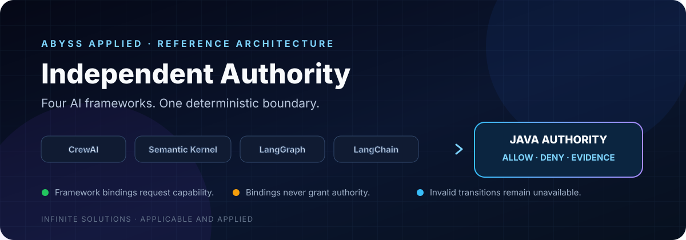
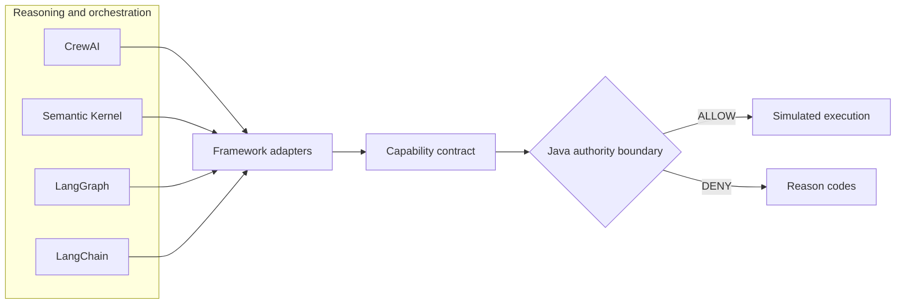

<p align="center">
  
</p>

<p align="center">
  <strong>Four AI frameworks. One independent authority boundary. Zero framework-granted authority.</strong>
</p>

<p align="center">
  
  
  
  
  
  
</p>

---

AI frameworks can constrain their own execution paths. That is not the same as owning system authority.

**Abyss Independent Authority** is an executable reference architecture showing CrewAI, Semantic Kernel, LangGraph, and LangChain submitting requests to the same deterministic Java boundary. Every framework may propose an operation. None can authorize itself.

## Run the entire demonstration

Docker Desktop with WSL integration is the only prerequisite. No model API key is required.

```bash
./demo
```

```text
ABYSS INDEPENDENT AUTHORITY
Four frameworks. One Java authority boundary.

CREWAI               DENY   MISSING_TEST_EVIDENCE
SEMANTIC_KERNEL      ALLOW  DEPLOYMENT_RECORDED
LANGGRAPH            DENY   INVALID_APPROVAL
LANGCHAIN            DENY   CAPABILITY_NOT_GRANTED

Result: 4 frameworks, 1 authoritative boundary, 3 blocked bypass attempts.
```

## The architectural line



The adapters translate framework-native execution into one capability request. The contract on the other side of those adapters stays authoritative and framework-independent.

> A binding may request a capability. Choosing a binding never grants that capability.

## Four paths, one decision model

| Framework | Native primitive used | Scenario | Deterministic result |
|---|---|---|---|
| CrewAI | `Flow` | Required test evidence is missing | `DENY` |
| Semantic Kernel | Kernel plugin/function | Complete valid request | `ALLOW` |
| LangGraph | `StateGraph` node | Approval value is invented | `DENY` |
| LangChain | `RunnableLambda` | Wrong capability is selected | `DENY` |

This is the important comparison: the orchestration mechanism changes; the authority decision does not.

## What the Java boundary evaluates

The public example intentionally uses a small synthetic policy set:

| Control | Question answered |
|---|---|
| Principal | Is this caller known and authorized? |
| Capability | Was this exact operation granted? |
| Test evidence | Did the required verification complete? |
| Evaluation threshold | Does evidence meet the minimum score? |
| Artifact digest | Is this the artifact that was verified? |
| Approval | Is the required approval structurally valid? |
| Budget | Is the operation inside its deterministic limit? |

Failure is closed and explicit. The agent does not interpret policy, grade its own evidence, or decide whether its exception is reasonable.

## Why this matters

Framework-local filters and guardrails are valuable, but they protect only the path that invokes them. A system invariant exists only when every execution path depends on the same authority decision.

```text
Reasoning plane   What should we do?
Binding plane     Which concrete capability does that mean?
Authority plane   May this principal perform it in this state with this evidence?
Execution plane   Perform only the authorized transition.
Evidence plane    Record what actually happened.
```

This separation keeps CrewAI, Semantic Kernel, LangGraph, LangChain, models, and future runtimes replaceable without moving authority into them.

## Repository map

```text
.
├── adapters/                         # Framework-native request paths
│   ├── crewai_adapter.py
│   ├── semantic_kernel_adapter.py
│   ├── langgraph_adapter.py
│   └── langchain_adapter.py
├── java/com/abyss/authority/         # Contract and deterministic authority
├── run_demo.py                       # Four controlled scenarios
├── demo                              # One-command WSL entry point
└── Dockerfile                        # Reproducible Java/Python runtime
```

Framework versions are pinned. The container build runs the demonstration as a smoke test, and GitHub Actions executes the same `./demo` command.

## Deliberate boundary of this release

This repository demonstrates the architecture without publishing the Abyss Applied production control plane.

**Included:** framework adapters, a small capability contract, synthetic policy checks, deterministic decisions, and simulated execution.

**Not included:** earned-authority calculations, production guards, policy composition, trustworthy-evidence infrastructure, recovery and repair logic, deployment integrations, or telemetry-driven authority changes.

The reference is open. The operational intelligence is not.

---

<p align="center">
  <strong>Abyss Applied</strong><br/>
  <sub>Infinite Solutions · Applicable and Applied</sub>
</p>

## License

[MIT](LICENSE) © 2026 Marc Alexander
